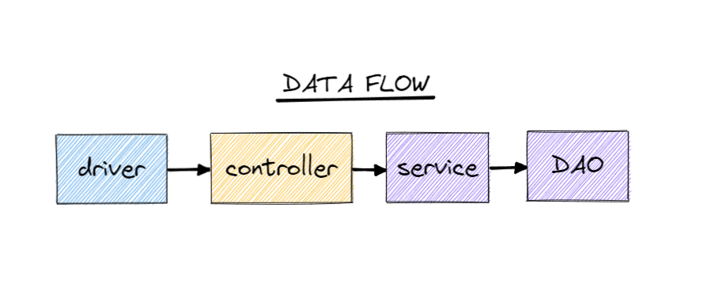
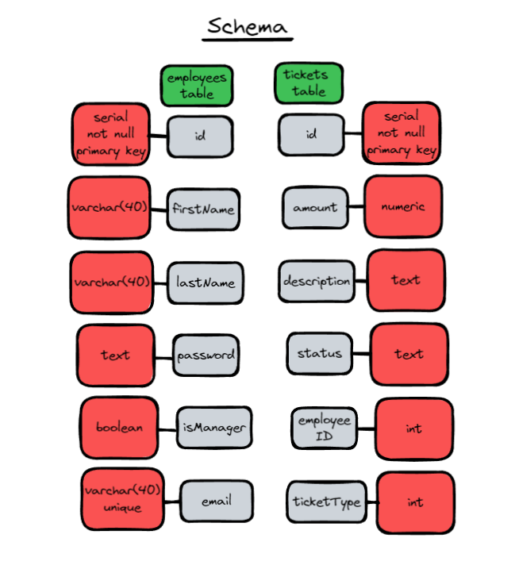
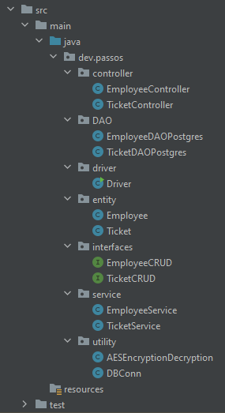

# ProjectOneRevature
develop a backend with Java, Javalin, JDBC, and Postgres, finally test the API.

## Table of Contents
* [General Info](#general-information)
* [Technologies Used](#technologies-used)
* [Features](#features)
* [Screenshots](#screenshots)
* [Setup](#setup)
* [Project Status](#project-status)
* [Room for Improvement](#room-for-improvement)
* [Contact](#contact)

## General Information
- This project was to better understand Docker, Java, and various Backend systems.
- This application implements basic authentication (trivial bearer tokens)
- This API can CRUD the employees and tickets table

## Technologies Used
- junit-jupiter-api - version 5.8.2
- mockito-all - version 1.10.19
- javalin - version 4.1.1
- gson - version 2.8.5
- postgresql - version 42.2.14

## Features
List the ready features here:
- Login/Register
- Submit Ticket
- Ticketing System
- View Previous Tickets

## Screenshots

<!-- If you have screenshots you'd like to share, include them here. -->

## Setup
download and install and ide of your own choiceing. Clone the repo and since this is a maven project, remember to inject those dependcies. Additionally, you would need to access the "DBConn.java" file and updated the information reflecting your postgres connection info, check the port, username, and password! Than you should be able to run both of the applications and use a tool such as postman to send a request.

## Project Status
Project is: _in progress_ / _complete_ / _no longer being worked on_. If you are no longer working on it, provide reasons why.

## Room for Improvement
Include areas you believe need improvement / could be improved. Also add TODOs for future development.

Room for improvement:
- definitly need to clean the code up
- service testing
- endpoint testing
- frontend?

To do:
- maybe you fork and contact for collab?

## Contact
Created by [@sergdev](https://www.sergdev.com/) - feel free to contact me!
